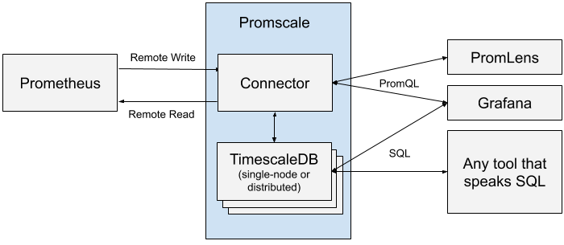

# Promscale
[](https://github.com/timescale/promscale/actions?query=workflow%3AGo)
[](https://github.com/timescale/promscale/actions?query=workflow%3A%22reviewdog+-+golangci%22)
[](https://goreportcard.com/report/github.com/timescale/promscale)
[](https://codeclimate.com/github/timescale/promscale/maintainability)
[](https://pkg.go.dev/github.com/timescale/promscale)

https://hub.docker.com/r/otopy/promscale


Promscale is an open-source long-term store for Prometheus data designed for
analytics. It is a **horizontally scalable**, **highly-compressed**, and
**operationally mature** platform for Prometheus data that offers the
combined power of PromQL and SQL, enabling developers to ask any question,
create any dashboard, and achieve greater visibility into their systems.
Promscale is built on top of [TimescaleDB](https://www.timescale.com/), the
leading relational database for time-series.




By allowing a user to use SQL, in addition to
PromQL, this platform empowers the user to ask complex analytical
queries from their metrics data, and thus extract more meaningful
insights.

✅  Promscale is currently the only long-term store for Prometheus data to have received a
[100% compliance test score](https://promlabs.com/promql-compliance-test-results-timescaledb)
(with no cross-cutting concerns) from PromLab's
[PromQL Compliance Test Suite](https://promlabs.com/promql-compliance-tests/).

For a detailed description of this architecture, please see [our design
doc][design-doc].

If you have any questions, please join the #promscale channel on
[TimescaleDB Slack](https://slack.timescale.com/), or the
[Promscale Users Google Group](https://groups.google.com/forum/#!forum/promscale-users).


### Configuring Prometheus to filter which metrics are sent (optional)

You can limit the metrics being sent to the adapter (and thus being
stored in your long-term storage) by setting up `write_relabel_configs`
in Prometheus, via the `prometheus.yml` file.
Doing this can reduce the amount of space used by your database and thus
increase query performance.

The example below drops all metrics starting with the prefix `go_`,
which matches Golang process information exposed by exporters like
`node_exporter`:

```
remote_write:
 - url: "http://promscale_connector:9201/write"
   write_relabel_configs:
      - source_labels: [__name__]
        regex: 'go_.*'
        action: drop
```
